# 🔄 Diagramas de Flujo - Explorador de Películas

## 📋 Resumen

Esta documentación contiene diagramas de flujo que explican cómo funciona la aplicación, desde la carga inicial hasta las interacciones del usuario.

## 🚀 Flujo de Carga Inicial

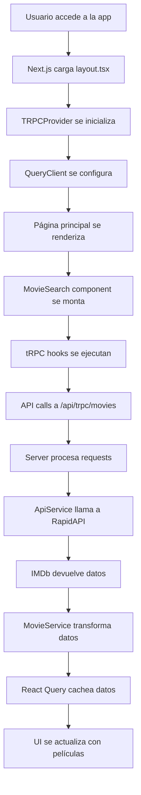

## 🔍 Flujo de Búsqueda

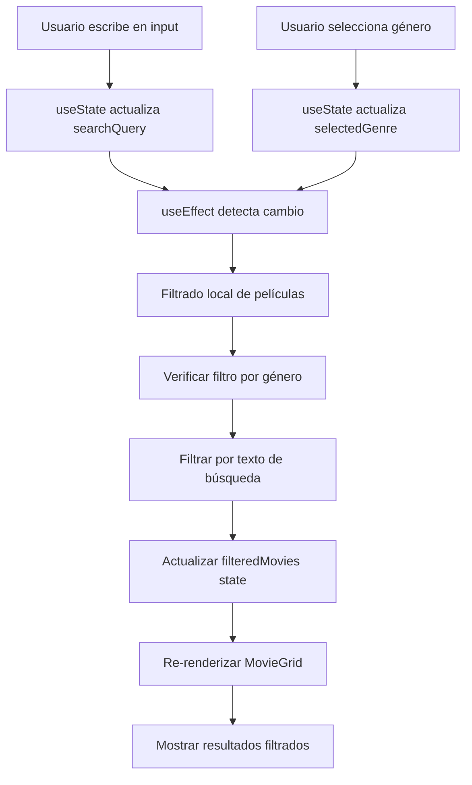

## 🎬 Flujo de Detalle de Película

```mermaid
graph TD
    A[Usuario hace click en MovieCard] --> B[Next.js navega a /movie/[id]]
    B --> C[Página de detalle se carga]
    C --> D[tRPC hook getMovieDetail se ejecuta]
    D --> E[API call con ID de película]
    E --> F[Server busca película por ID]
    F --> G{¿Película encontrada?}
    G -->|Sí| H[Devolver datos de película]
    G -->|No| I[Devolver error 404]
    H --> J[React Query cachea datos]
    I --> K[Mostrar error state]
    J --> L[Renderizar detalle completo]
    K --> M[Mostrar mensaje de error]
```

## 🔄 Flujo de Datos Completo

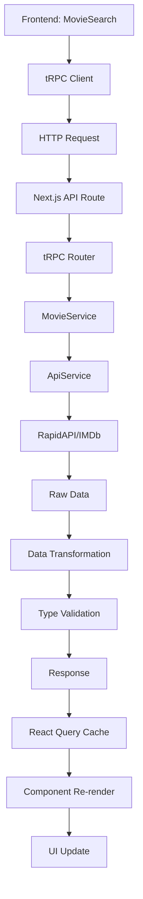

## 🎨 Flujo de Estados de UI

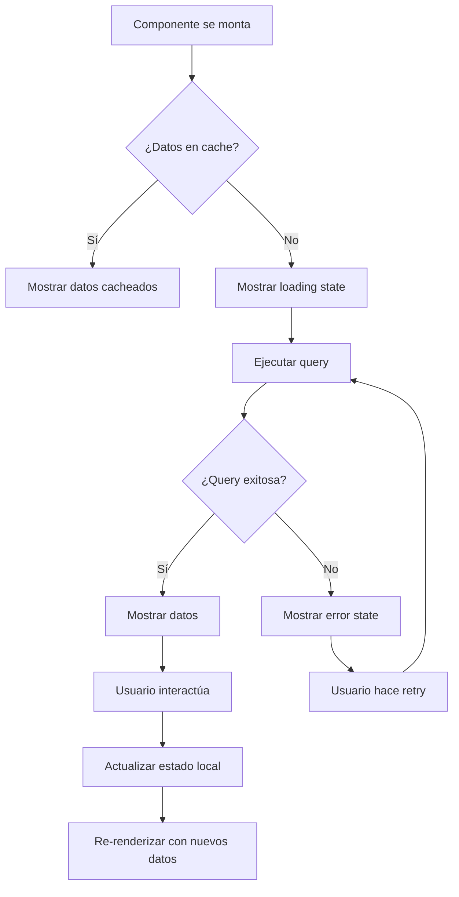

## 🔧 Flujo de Configuración

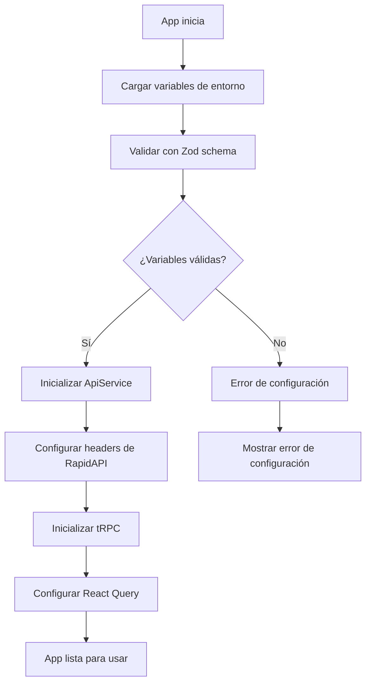

## 📱 Flujo de Responsive Design

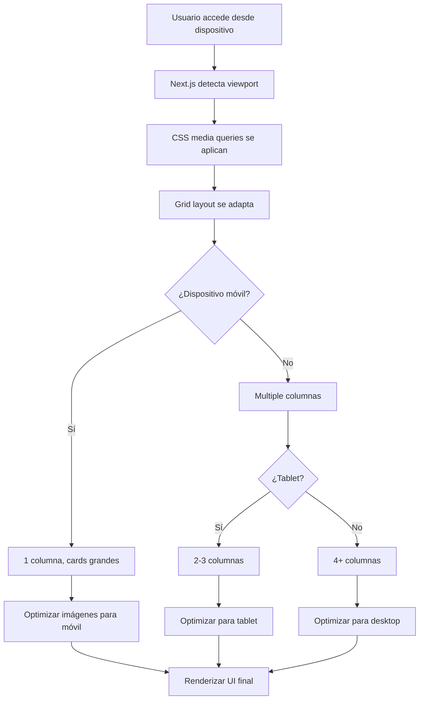

## 🚨 Flujo de Manejo de Errores

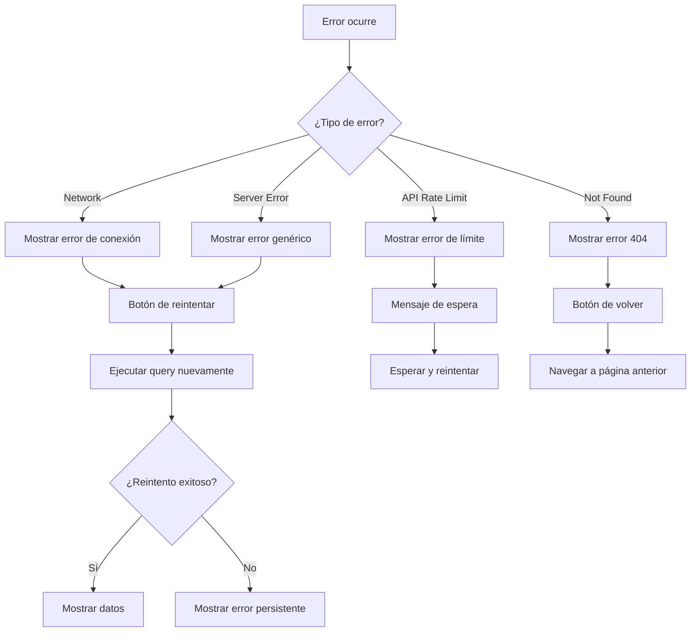

## 🔄 Flujo de Cache y Performance

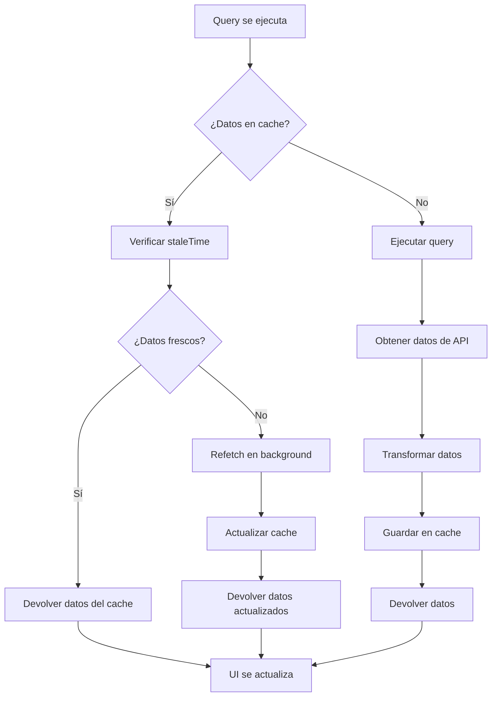

## 🎯 Flujo de Optimización de Imágenes

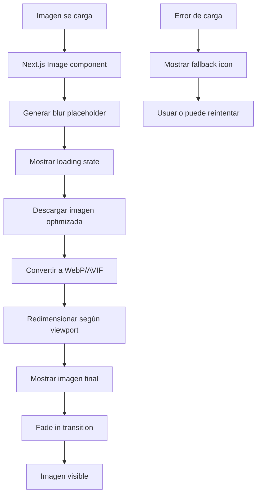

## 📊 Flujo de Métricas y Analytics

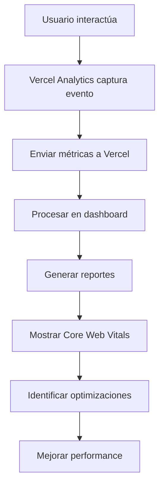

## 🔐 Flujo de Seguridad

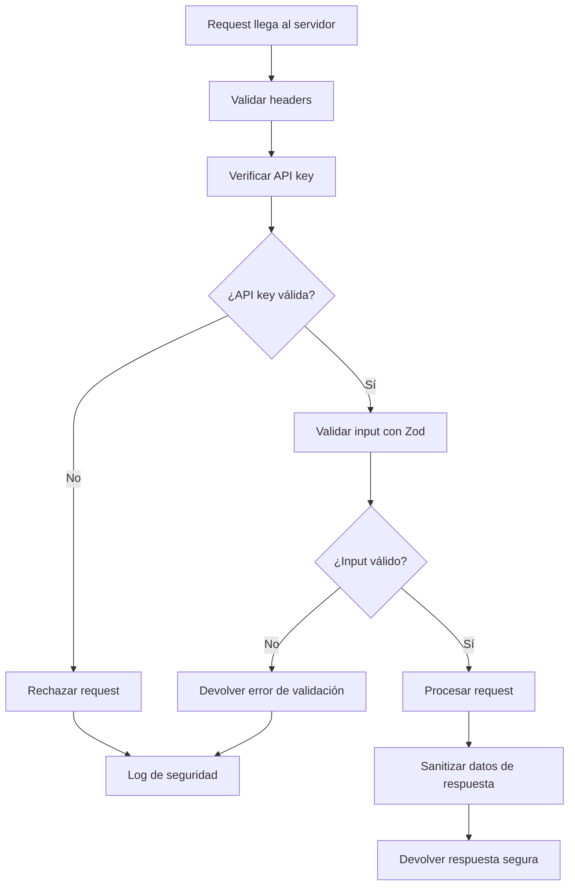

## 🚀 Flujo de Despliegue

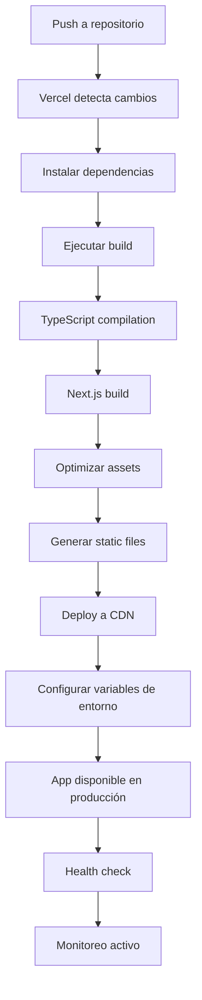

---

## 📝 Notas sobre los Diagramas

### Convenciones Utilizadas
- **Rectángulos**: Procesos o acciones
- **Diamantes**: Decisiones o condiciones
- **Círculos**: Puntos de inicio/fin
- **Flechas**: Flujo de datos o control

### Colores Sugeridos
- **Verde**: Procesos exitosos
- **Rojo**: Errores o fallos
- **Azul**: Procesos de datos
- **Amarillo**: Advertencias o validaciones

### Herramientas Recomendadas
- **Mermaid**: Para crear y editar diagramas
- **Draw.io**: Para diagramas más complejos
- **Figma**: Para diagramas de UI/UX

---

**Última actualización**: Diciembre 2024
