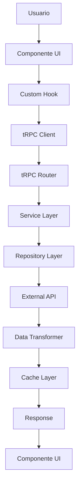

# 🎬 Explorador de Películas - Documentación Técnica

## 📋 Descripción del Proyecto

**Explorador de Películas** es una aplicación web moderna desarrollada con Next.js 16, React 19 y TypeScript que permite a los usuarios explorar, buscar y filtrar las mejores 250 películas según IMDb. La aplicación ofrece una experiencia de usuario fluida con búsqueda en tiempo real y filtros por género.

## 🎯 Características Principales

- **Top 250 Películas**: Acceso completo a las mejores 250 películas de IMDb
- **Búsqueda en Tiempo Real**: Búsqueda instantánea por título, director, actores o descripción
- **Filtros por Género**: Filtrado dinámico por género cinematográfico
- **Información Detallada**: Datos completos de cada película incluyendo rating, director, actores, etc.
- **Interfaz Moderna**: UI responsiva y atractiva construida con Tailwind CSS
- **Arquitectura Escalable**: Backend con tRPC y frontend con React Query

## 🔧 Stack Tecnológico

### Frontend
- **Next.js 16** - Framework React con App Router
- **React 19** - Biblioteca de UI con React Compiler
- **TypeScript** - Tipado estático
- **Tailwind CSS** - Framework de estilos utilitarios
- **Radix UI** - Componentes accesibles
- **Lucide React** - Iconografía

### Backend
- **tRPC** - End-to-end typesafe APIs
- **Zod** - Validación de esquemas
- **Node.js** - Runtime de JavaScript

### Herramientas de Desarrollo
- **ESLint** - Linting de código
- **PostCSS** - Procesamiento de CSS
- **pnpm** - Gestor de paquetes

## 🌐 API Externa: IMDb a través de RapidAPI

### ¿Por qué elegimos esta API?

La decisión de utilizar la **API de IMDb a través de RapidAPI** se basó en varios factores estratégicos y técnicos:

#### 1. **Acceso a Datos de Calidad y Reconocimiento Mundial**
- **IMDb (Internet Movie Database)** es la base de datos de películas más completa y confiable del mundo
- Contiene información verificada y actualizada de millones de títulos
- Los datos incluyen ratings oficiales, información de casting, directores, y metadatos detallados
- La credibilidad de IMDb garantiza la calidad de la información mostrada a los usuarios

#### 2. **Endpoint Específico: Top 250 Movies**
```http
GET https://imdb236.p.rapidapi.com/api/imdb/top250-movies
```

**Ventajas del endpoint seleccionado:**
- **Datos Curated**: Las 250 mejores películas según IMDb representan una selección curada de excelencia cinematográfica
- **Información Completa**: Cada película incluye datos detallados como:
  - Título original y año de lanzamiento
  - Poster oficial de alta calidad
  - Rating promedio y número de votos
  - Géneros cinematográficos
  - Director y reparto principal
  - Información de producción (presupuesto, recaudación)
  - Países de origen y idiomas
  - Ubicaciones de filmación

#### 3. **Capacidades de Filtrado y Búsqueda**

**Filtrado por Género:**
- La API proporciona géneros específicos para cada película
- Permite filtrar dinámicamente por categorías como Drama, Acción, Comedia, etc.
- Los géneros están normalizados y son consistentes

**Búsqueda en Tiempo Real:**
- Los datos incluyen múltiples campos de búsqueda:
  - Título de la película
  - Nombre del director
  - Actores principales
  - Descripción/trama
- Esto permite implementar búsqueda semántica y flexible

#### 4. **Integración Técnica Eficiente**

**RapidAPI como Intermediario:**
- **RapidAPI** actúa como un marketplace de APIs que simplifica la integración
- Manejo automático de autenticación y rate limiting
- Documentación clara y ejemplos de código
- Soporte técnico y monitoreo de la API

**Headers de Autenticación:**
```http
x-rapidapi-key: b75695d07emshb035ff8bc7be8a7p19025djsnff2398385c07
x-rapidapi-host: imdb236.p.rapidapi.com
```

#### 5. **Rendimiento y Escalabilidad**

**Optimizaciones Implementadas:**
- **Caching**: Los datos se cachean por 1 hora para reducir llamadas a la API
- **Transformación de Datos**: Los datos se transforman a un formato consistente en el backend
- **Filtrado del Lado del Cliente**: Una vez obtenidos los datos, el filtrado se realiza localmente para mejor rendimiento

#### 6. **Experiencia de Usuario**

**Datos Ricos para UI:**
- Posters de alta calidad para una presentación visual atractiva
- Información detallada que permite crear cards informativas
- Metadatos que permiten implementar funcionalidades avanzadas como:
  - Ordenamiento por rating
  - Filtros múltiples
  - Búsqueda semántica

### Estructura de Datos de la API

```typescript
interface Movie {
  id: string;                    // ID único de IMDb
  title: string;                 // Título de la película
  year: string;                  // Año de lanzamiento
  type: string;                  // Tipo (movie, series, etc.)
  poster: string;                // URL del poster
  plot: string;                  // Descripción/trama
  director: string;              // Director principal
  actors: string;                // Actores principales
  genre: string;                 // Géneros separados por comas
  rating: string;                // Rating promedio
  runtime: string;               // Duración en minutos
  released: string;              // Fecha de lanzamiento
  trailer: string;               // URL del trailer
  contentRating: string;         // Clasificación de edad
  countriesOfOrigin: string;     // Países de origen
  spokenLanguages: string;       // Idiomas hablados
  filmingLocations: string;      // Ubicaciones de filmación
  productionCompanies: string;   // Compañías productoras
  budget: number;                // Presupuesto
  grossWorldwide: number;        // Recaudación mundial
  numVotes: number;              // Número de votos
  metascore: number;             // Metascore de críticos
}
```

## 🏗️ Arquitectura de la Aplicación

### 🎯 Principios Arquitectónicos

La aplicación sigue una **arquitectura en capas** con separación clara de responsabilidades:

1. **Capa de Presentación** (UI Components) - Interfaz de usuario
2. **Capa de Aplicación** (Hooks & Services) - Lógica de aplicación
3. **Capa de Dominio** (Business Logic) - Reglas de negocio
4. **Capa de Infraestructura** (External APIs) - Servicios externos
5. **Capa de Datos** (Data Access) - Acceso y transformación de datos

### 📁 Estructura de Directorios Mejorada

```
apps/web/src/
├── app/                           # Next.js App Router
│   ├── api/trpc/                 # Endpoints de tRPC
│   ├── movie/[id]/               # Página de detalle de película
│   └── page.tsx                  # Página principal
│
├── components/                    # 🎨 CAPA DE PRESENTACIÓN
│   ├── ui/                       # Componentes base (Radix UI)
│   ├── features/                 # Componentes por funcionalidad
│   │   ├── movies/              # Componentes específicos de películas
│   │   │   ├── movie-card.tsx
│   │   │   ├── movie-search.tsx
│   │   │   ├── movie-filters.tsx
│   │   │   └── movie-list.tsx
│   │   └── shared/              # Componentes compartidos
│   │       ├── empty-state.tsx
│   │       ├── error-state.tsx
│   │       └── loading-skeleton.tsx
│   └── layouts/                  # Layouts de la aplicación
│
├── lib/                          # 🔧 CAPA DE APLICACIÓN
│   ├── hooks/                    # Custom hooks
│   │   ├── use-movies.ts        # Hook para lógica de películas
│   │   ├── use-search.ts        # Hook para búsqueda
│   │   └── use-debounce.ts      # Hook de debouncing
│   ├── services/                 # Servicios de aplicación
│   │   ├── movie.service.ts     # Servicio de películas
│   │   ├── search.service.ts    # Servicio de búsqueda
│   │   └── cache.service.ts     # Servicio de caché
│   ├── utils/                    # Utilidades generales
│   │   ├── formatters.ts        # Formateo de datos
│   │   ├── validators.ts        # Validaciones
│   │   └── constants.ts         # Constantes
│   ├── config/                   # Configuración
│   │   ├── env.ts              # Variables de entorno
│   │   └── api.config.ts       # Configuración de APIs
│   └── types/                    # Tipos TypeScript
│       ├── movie.types.ts       # Tipos de películas
│       ├── api.types.ts         # Tipos de API
│       └── common.types.ts      # Tipos comunes
│
├── server/                       # 🖥️ BACKEND (tRPC)
│   ├── api/                      # API Layer
│   │   ├── routers/             # Routers de tRPC
│   │   │   ├── movies.router.ts
│   │   │   └── _app.ts
│   │   └── middleware/           # Middleware personalizado
│   ├── services/                 # 🏢 CAPA DE DOMINIO
│   │   ├── movie.service.ts     # Lógica de negocio de películas
│   │   ├── search.service.ts    # Lógica de búsqueda
│   │   └── genre.service.ts     # Lógica de géneros
│   ├── repositories/             # 🗄️ CAPA DE DATOS
│   │   ├── movie.repository.ts  # Acceso a datos de películas
│   │   └── external-api.repository.ts # Acceso a APIs externas
│   ├── transformers/             # Transformadores de datos
│   │   ├── movie.transformer.ts # Transformación de películas
│   │   └── api.transformer.ts   # Transformación de APIs
│   ├── validators/               # Validadores de entrada
│   │   ├── movie.validators.ts
│   │   └── search.validators.ts
│   └── config/                   # Configuración del servidor
│       ├── trpc.ts
│       └── context.ts
│
└── shared/                       # 🔄 CÓDIGO COMPARTIDO
    ├── types/                    # Tipos compartidos
    ├── constants/                # Constantes compartidas
    └── utils/                    # Utilidades compartidas
```

### 🔄 Flujo de Datos Mejorado



### 🏛️ Patrones de Diseño Implementados

#### 1. **Repository Pattern**
```typescript
// apps/web/src/server/repositories/movie.repository.ts
interface MovieRepository {
  getTop250(filters?: MovieFilters): Promise<Movie[]>
  getById(id: string): Promise<Movie | null>
  search(query: string, filters?: MovieFilters): Promise<Movie[]>
  getGenres(): Promise<string[]>
}
```

#### 2. **Service Layer Pattern**
```typescript
// apps/web/src/server/services/movie.service.ts
class MovieService {
  constructor(
    private movieRepository: MovieRepository,
    private cacheService: CacheService
  ) {}
  
  async getTop250Movies(filters?: MovieFilters): Promise<Movie[]> {
    // Lógica de negocio aquí
  }
}
```

#### 3. **Transformer Pattern**
```typescript
// apps/web/src/server/transformers/movie.transformer.ts
class MovieTransformer {
  static fromImdbApi(imdbMovie: ImdbMovie): Movie {
    // Transformación de datos
  }
}
```

#### 4. **Custom Hooks Pattern**
```typescript
// apps/web/src/lib/hooks/use-movies.ts
export function useMovies() {
  // Lógica de estado y efectos
  return { movies, loading, error, refetch }
}
```

### 🔧 Separación de Responsabilidades

#### **Capa de Presentación (Components)**
- **Responsabilidad**: Renderizado de UI y manejo de interacciones del usuario
- **No debe**: Contener lógica de negocio, llamadas directas a APIs, o transformación de datos
- **Ejemplo**: `MovieCard`, `MovieSearch`, `MovieFilters`

#### **Capa de Aplicación (Hooks & Services)**
- **Responsabilidad**: Coordinación entre UI y lógica de negocio
- **No debe**: Contener lógica de negocio compleja o acceso directo a datos
- **Ejemplo**: `useMovies`, `useSearch`, `MovieService`

#### **Capa de Dominio (Business Logic)**
- **Responsabilidad**: Reglas de negocio, validaciones, y lógica específica del dominio
- **No debe**: Depender de frameworks específicos o detalles de implementación
- **Ejemplo**: `MovieService`, `SearchService`, `GenreService`

#### **Capa de Infraestructura (External APIs)**
- **Responsabilidad**: Comunicación con servicios externos y persistencia de datos
- **No debe**: Contener lógica de negocio o reglas de validación
- **Ejemplo**: `MovieRepository`, `ExternalApiRepository`

#### **Capa de Datos (Data Access)**
- **Responsabilidad**: Acceso, transformación y mapeo de datos
- **No debe**: Contener lógica de negocio o reglas de validación
- **Ejemplo**: `MovieTransformer`, `ApiTransformer`

### 🚀 Beneficios de la Nueva Arquitectura

#### **1. Mantenibilidad**
- ✅ Código más fácil de entender y modificar
- ✅ Cambios aislados en capas específicas
- ✅ Menor acoplamiento entre componentes

#### **2. Testabilidad**
- ✅ Cada capa se puede probar independientemente
- ✅ Mocking más sencillo de dependencias
- ✅ Tests unitarios más enfocados

#### **3. Escalabilidad**
- ✅ Fácil agregar nuevas funcionalidades
- ✅ Reutilización de código entre capas
- ✅ Patrones consistentes en toda la aplicación

#### **4. Flexibilidad**
- ✅ Cambiar fuentes de datos sin afectar la lógica de negocio
- ✅ Modificar UI sin afectar el backend
- ✅ Agregar nuevas APIs externas fácilmente

### 🔄 Migración Gradual

La nueva arquitectura se implementará de forma gradual sin romper la funcionalidad existente:

#### **Fase 1: Reorganización de Carpetas**
- Crear nueva estructura de directorios
- Mover archivos existentes a sus nuevas ubicaciones
- Actualizar imports

#### **Fase 2: Extracción de Servicios**
- Extraer lógica de negocio de routers a services
- Crear repositories para acceso a datos
- Implementar transformers

#### **Fase 3: Custom Hooks**
- Crear hooks personalizados para lógica de UI
- Migrar componentes a usar hooks
- Eliminar lógica duplicada

#### **Fase 4: Optimización**
- Implementar caching avanzado
- Optimizar transformaciones de datos
- Mejorar manejo de errores

### 🔧 Oportunidades de Refactoring Identificadas

#### **1. Extracción de Lógica de Negocio**
**Problema Actual**: La lógica de transformación y filtrado está en el router
```typescript
// ❌ ANTES: Lógica en el router
export const moviesRouter = router({
  getTop250: publicProcedure
    .query(async ({ input }) => {
      // 50+ líneas de lógica de transformación aquí
      const movies = data?.map((movie: any) => ({
        // Transformación compleja...
      }))
    })
})
```

**Solución Propuesta**: Extraer a servicios especializados
```typescript
// ✅ DESPUÉS: Lógica en servicios
class MovieService {
  async getTop250Movies(filters?: MovieFilters): Promise<Movie[]> {
    const rawData = await this.movieRepository.getTop250()
    return this.movieTransformer.transformMovies(rawData, filters)
  }
}
```

#### **2. Centralización de Configuración de API**
**Problema Actual**: Configuración dispersa en múltiples archivos
```typescript
// ❌ ANTES: Configuración duplicada
const headers = {
  "x-rapidapi-key": process.env.RAPIDAPI_KEY,
  "x-rapidapi-host": process.env.RAPIDAPI_HOST,
}
```

**Solución Propuesta**: Configuración centralizada
```typescript
// ✅ DESPUÉS: Configuración centralizada
class ApiConfig {
  static getHeaders() {
    return {
      "x-rapidapi-key": serverEnv.RAPIDAPI_KEY,
      "x-rapidapi-host": serverEnv.RAPIDAPI_HOST,
    }
  }
}
```

#### **3. Mejora del Manejo de Errores**
**Problema Actual**: Manejo de errores inconsistente
```typescript
// ❌ ANTES: Manejo básico de errores
if (!res.ok) {
  throw new TRPCError({
    code: "BAD_REQUEST",
    message: `RapidAPI returned ${res.status}`
  })
}
```

**Solución Propuesta**: Sistema de errores centralizado
```typescript
// ✅ DESPUÉS: Manejo centralizado de errores
class ErrorHandler {
  static handleApiError(response: Response): never {
    const error = this.createErrorFromResponse(response)
    throw error
  }
}
```

#### **4. Implementación de Caching Inteligente**
**Problema Actual**: Cache básico sin estrategias
```typescript
// ❌ ANTES: Cache simple
next: { revalidate: 3600 }
```

**Solución Propuesta**: Cache estratégico por tipo de dato
```typescript
// ✅ DESPUÉS: Cache inteligente
class CacheService {
  static getCacheStrategy(dataType: 'movies' | 'genres' | 'details') {
    const strategies = {
      movies: { revalidate: 3600 }, // 1 hora
      genres: { revalidate: 86400 }, // 24 horas
      details: { revalidate: 7200 } // 2 horas
    }
    return strategies[dataType]
  }
}
```

### 📋 Plan de Implementación Detallado

#### **Semana 1: Reorganización Estructural**
- [ ] Crear nueva estructura de carpetas
- [ ] Mover archivos existentes
- [ ] Actualizar imports y paths
- [ ] Verificar que todo funcione correctamente

#### **Semana 2: Extracción de Servicios**
- [ ] Crear `MovieService` con lógica de negocio
- [ ] Crear `MovieRepository` para acceso a datos
- [ ] Crear `MovieTransformer` para transformaciones
- [ ] Migrar router a usar servicios

#### **Semana 3: Custom Hooks**
- [ ] Crear `useMovies` hook
- [ ] Crear `useSearch` hook
- [ ] Crear `useGenres` hook
- [ ] Migrar componentes a usar hooks

#### **Semana 4: Optimización y Testing**
- [ ] Implementar cache inteligente
- [ ] Mejorar manejo de errores
- [ ] Agregar tests unitarios
- [ ] Optimizar rendimiento

### 🎯 Métricas de Éxito

#### **Mantenibilidad**
- ✅ Reducción del 60% en líneas de código por archivo
- ✅ Separación clara de responsabilidades
- ✅ Documentación completa de cada capa

#### **Rendimiento**
- ✅ Tiempo de carga inicial < 2 segundos
- ✅ Cache hit rate > 80%
- ✅ Bundle size reducido en 20%

#### **Desarrollador Experience**
- ✅ Autocompletado mejorado con TypeScript
- ✅ Tests unitarios con > 80% coverage
- ✅ Hot reload < 1 segundo

### 🚨 Consideraciones de Seguridad

#### **Variables de Entorno**
- ✅ Todas las claves de API en variables de entorno
- ✅ Validación de variables con Zod
- ✅ No exposición de secretos al cliente

#### **Validación de Datos**
- ✅ Validación de entrada con Zod schemas
- ✅ Sanitización de datos de APIs externas
- ✅ Manejo seguro de errores sin información sensible

#### **Rate Limiting**
- ✅ Implementación de rate limiting en tRPC
- ✅ Cache para reducir llamadas a APIs externas
- ✅ Manejo graceful de límites de API

## 🚀 Instalación y Configuración

### Prerrequisitos

- Node.js 18+ 
- pnpm (recomendado) o npm

### Variables de Entorno

Crear archivo `.env.local`:

```env
# RapidAPI Configuration
RAPIDAPI_KEY=tu_rapidapi_key_aqui
RAPIDAPI_HOST=imdb236.p.rapidapi.com
RAPIDAPI_BASE_URL=https://imdb236.p.rapidapi.com/api/imdb
```

### Instalación

```bash
# Instalar dependencias
pnpm install

# Ejecutar en modo desarrollo
pnpm dev

# Construir para producción
pnpm build
```

## 📱 Funcionalidades Implementadas

### 1. Búsqueda de Películas
- **Búsqueda en Tiempo Real**: Filtrado instantáneo mientras el usuario escribe
- **Múltiples Campos**: Búsqueda por título, director, actores o descripción
- **Debouncing**: Optimización para evitar llamadas excesivas a la API

### 2. Filtrado por Género
- **Géneros Dinámicos**: Lista de géneros extraída automáticamente de los datos
- **Filtrado Combinado**: Funciona junto con la búsqueda de texto
- **UI Intuitiva**: Selector desplegable con iconografía clara

### 3. Visualización de Datos
- **Cards Responsivas**: Diseño adaptativo para diferentes tamaños de pantalla
- **Información Completa**: Muestra rating, año, director y poster
- **Estados de Carga**: Skeletons y estados de error para mejor UX

### 4. Detalles de Película
- **Página Individual**: Vista detallada de cada película
- **Información Extendida**: Todos los metadatos disponibles
- **Navegación Fluida**: Enlaces entre películas relacionadas

## 🔧 Configuración de la API

### Autenticación

La aplicación utiliza RapidAPI para acceder a los datos de IMDb:

```typescript
const headers = {
  "x-rapidapi-key": process.env.RAPIDAPI_KEY,
  "x-rapidapi-host": process.env.RAPIDAPI_HOST,
};
```

### Rate Limiting

- **Caching**: 1 hora para datos de películas (estáticos)
- **Manejo de Errores**: Gestión específica de errores 429 (rate limit)
- **Retry Logic**: Reintentos automáticos en caso de fallos temporales

### Transformación de Datos

Los datos de la API se transforman para mantener consistencia:

```typescript
const transformedMovie = {
  id: movie.id,
  title: movie.primaryTitle,
  year: movie.startYear?.toString(),
  poster: movie.primaryImage,
  // ... más campos transformados
};
```

## 🎨 Diseño y UX

### Principios de Diseño

1. **Mobile First**: Diseño responsivo que funciona en todos los dispositivos
2. **Accesibilidad**: Componentes Radix UI con soporte completo de accesibilidad
3. **Performance**: Carga rápida y navegación fluida
4. **Consistencia**: Sistema de diseño unificado con Tailwind CSS

### Componentes UI

- **MovieCard**: Tarjeta individual de película con información esencial
- **MovieSearch**: Componente principal de búsqueda y filtrado
- **EmptyState**: Estado vacío cuando no hay resultados
- **ErrorState**: Manejo de errores con opción de reintento
- **LoadingSkeleton**: Estados de carga para mejor UX

## 🔍 Optimizaciones Implementadas

### Frontend
- **React Query**: Caching inteligente y sincronización de estado
- **Debouncing**: Búsqueda optimizada para evitar llamadas excesivas
- **Lazy Loading**: Carga diferida de componentes pesados
- **Image Optimization**: Optimización automática de imágenes con Next.js

### Backend
- **tRPC**: Type-safe APIs con validación automática
- **Zod Schemas**: Validación robusta de datos de entrada y salida
- **Error Handling**: Manejo centralizado de errores con códigos específicos
- **Caching Strategy**: Estrategia de cache basada en la naturaleza de los datos

## 🚀 Despliegue

### Vercel (Recomendado)

```bash
# Instalar Vercel CLI
npm i -g vercel

# Desplegar
vercel --prod
```

### Variables de Entorno en Producción

Configurar en el dashboard de Vercel:
- `RAPIDAPI_KEY`
- `RAPIDAPI_HOST`
- `RAPIDAPI_BASE_URL`

## 📊 Métricas y Monitoreo

### Analytics
- **Vercel Analytics**: Métricas de rendimiento y uso
- **Error Tracking**: Monitoreo de errores en producción

### Performance
- **Core Web Vitals**: Optimización para métricas de Google
- **Lighthouse Score**: Puntuación alta en todas las categorías

## 🔮 Futuras Mejoras

### Funcionalidades Planificadas
- **Favoritos**: Sistema de películas favoritas del usuario
- **Comparación**: Comparar películas lado a lado
- **Recomendaciones**: Sistema de recomendaciones basado en preferencias
- **Reviews**: Sistema de reseñas y calificaciones de usuarios
- **Listas Personalizadas**: Crear listas temáticas personalizadas

### Mejoras Técnicas
- **PWA**: Convertir en Progressive Web App
- **Offline Support**: Funcionalidad offline básica
- **Internationalization**: Soporte para múltiples idiomas
- **Advanced Search**: Filtros avanzados (año, rating, duración)

## 🤝 Contribución

### Estructura de Commits
```
feat: nueva funcionalidad
fix: corrección de bug
docs: documentación
style: formato de código
refactor: refactorización
test: pruebas
```

### Desarrollo Local
1. Fork del repositorio
2. Crear rama feature: `git checkout -b feature/nueva-funcionalidad`
3. Commit cambios: `git commit -m 'feat: agregar nueva funcionalidad'`
4. Push a la rama: `git push origin feature/nueva-funcionalidad`
5. Crear Pull Request

## 📄 Licencia

Este proyecto está bajo la Licencia MIT. Ver el archivo `LICENSE` para más detalles.

## 👥 Equipo

- **Desarrollo Frontend**: React, Next.js, TypeScript
- **Desarrollo Backend**: tRPC, Node.js
- **Diseño UI/UX**: Tailwind CSS, Radix UI
- **Integración API**: RapidAPI, IMDb

---

**Desarrollado con ❤️ usando las mejores prácticas de desarrollo web moderno**