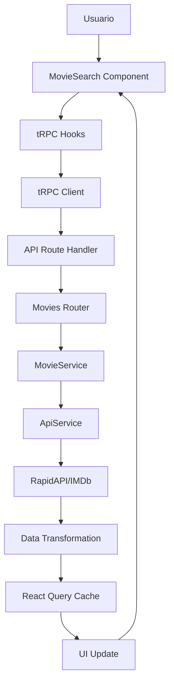

# 🎬 Explorador de Películas - Documentación Técnica

## 📋 Descripción del Proyecto

**Explorador de Películas** es una aplicación web moderna desarrollada con Next.js 16, React 19 y TypeScript que permite a los usuarios explorar, buscar y filtrar las mejores 250 películas según IMDb. La aplicación ofrece una experiencia de usuario fluida con búsqueda en tiempo real y filtros por género.

## 🎯 Características Principales

- **Top 250 Películas**: Acceso completo a las mejores 250 películas de IMDb
- **Búsqueda en Tiempo Real**: Búsqueda instantánea por título, director, actores o descripción
- **Filtros por Género**: Filtrado dinámico por género cinematográfico
- **Información Detallada**: Datos completos de cada película incluyendo rating, director, actores, etc.
- **Interfaz Moderna**: UI responsiva y atractiva construida con Tailwind CSS y Radix UI
- **Arquitectura Escalable**: Backend con tRPC y frontend con React Query
- **Optimizaciones de Performance**: Imágenes optimizadas, lazy loading y caching inteligente

## 🔧 Stack Tecnológico

### Frontend
- **Next.js 16** - Framework React con App Router y Turbopack
- **React 19** - Biblioteca de UI con React Compiler
- **TypeScript 5.9** - Tipado estático completo
- **Tailwind CSS 4.1** - Framework de estilos utilitarios
- **Radix UI** - Componentes accesibles (Dialog, Select, Label, etc.)
- **Lucide React** - Iconografía moderna
- **React Query (TanStack)** - Manejo de estado del servidor y caching

### Backend
- **tRPC 11.6** - End-to-end typesafe APIs
- **Zod 4.1** - Validación de esquemas y tipos
- **Node.js 18+** - Runtime de JavaScript
- **SuperJSON** - Serialización de datos complejos

### Herramientas de Desarrollo
- **ESLint 9** - Linting de código
- **PostCSS** - Procesamiento de CSS
- **pnpm 10.19** - Gestor de paquetes
- **Turborepo** - Monorepo management
- **Vercel Analytics** - Métricas de performance

## 🌐 API Externa: IMDb a través de RapidAPI

### ¿Por qué elegimos esta API?

La decisión de utilizar la **API de IMDb a través de RapidAPI** se basó en varios factores estratégicos y técnicos:

#### 1. **Acceso a Datos de Calidad y Reconocimiento Mundial**
- **IMDb (Internet Movie Database)** es la base de datos de películas más completa y confiable del mundo
- Contiene información verificada y actualizada de millones de títulos
- Los datos incluyen ratings oficiales, información de casting, directores, y metadatos detallados
- La credibilidad de IMDb garantiza la calidad de la información mostrada a los usuarios

#### 2. **Endpoint Específico: Top 250 Movies**
```http
GET https://imdb236.p.rapidapi.com/api/imdb/top250-movies
```

**Ventajas del endpoint seleccionado:**
- **Datos Curated**: Las 250 mejores películas según IMDb representan una selección curada de excelencia cinematográfica
- **Información Completa**: Cada película incluye datos detallados como:
  - Título original y año de lanzamiento
  - Poster oficial de alta calidad
  - Rating promedio y número de votos
  - Géneros cinematográficos
  - Director y reparto principal
  - Información de producción (presupuesto, recaudación)
  - Países de origen y idiomas
  - Ubicaciones de filmación

#### 3. **Capacidades de Filtrado y Búsqueda**

**Filtrado por Género:**
- La API proporciona géneros específicos para cada película
- Permite filtrar dinámicamente por categorías como Drama, Acción, Comedia, etc.
- Los géneros están normalizados y son consistentes

**Búsqueda en Tiempo Real:**
- Los datos incluyen múltiples campos de búsqueda:
  - Título de la película
  - Nombre del director
  - Actores principales
  - Descripción/trama
- Esto permite implementar búsqueda semántica y flexible

#### 4. **Integración Técnica Eficiente**

**RapidAPI como Intermediario:**
- **RapidAPI** actúa como un marketplace de APIs que simplifica la integración
- Manejo automático de autenticación y rate limiting
- Documentación clara y ejemplos de código
- Soporte técnico y monitoreo de la API

**Headers de Autenticación:**
```http
x-rapidapi-key: b75695d07emshb035ff8bc7be8a7p19025djsnff2398385c07
x-rapidapi-host: imdb236.p.rapidapi.com
```

#### 5. **Rendimiento y Escalabilidad**

**Optimizaciones Implementadas:**
- **Caching**: Los datos se cachean por 1 hora para reducir llamadas a la API
- **Transformación de Datos**: Los datos se transforman a un formato consistente en el backend
- **Filtrado del Lado del Cliente**: Una vez obtenidos los datos, el filtrado se realiza localmente para mejor rendimiento

#### 6. **Experiencia de Usuario**

**Datos Ricos para UI:**
- Posters de alta calidad para una presentación visual atractiva
- Información detallada que permite crear cards informativas
- Metadatos que permiten implementar funcionalidades avanzadas como:
  - Ordenamiento por rating
  - Filtros múltiples
  - Búsqueda semántica

### Estructura de Datos de la API

```typescript
interface Movie {
  id: string;                    // ID único de IMDb
  title: string;                 // Título de la película
  year: string;                  // Año de lanzamiento
  type: string;                  // Tipo (movie, series, etc.)
  poster: string;                // URL del poster
  plot: string;                  // Descripción/trama
  director: string;              // Director principal
  actors: string;                // Actores principales
  genre: string;                 // Géneros separados por comas
  rating: string;                // Rating promedio
  runtime: string;               // Duración en minutos
  released: string;              // Fecha de lanzamiento
  trailer: string;               // URL del trailer
  contentRating: string;         // Clasificación de edad
  countriesOfOrigin: string;     // Países de origen
  spokenLanguages: string;       // Idiomas hablados
  filmingLocations: string;      // Ubicaciones de filmación
  productionCompanies: string;   // Compañías productoras
  budget: number;                // Presupuesto
  grossWorldwide: number;        // Recaudación mundial
  numVotes: number;              // Número de votos
  metascore: number;             // Metascore de críticos
}
```

## 🏗️ Arquitectura de la Aplicación

### 🎯 Principios Arquitectónicos

La aplicación sigue una **arquitectura moderna** con separación clara de responsabilidades:

1. **Capa de Presentación** (UI Components) - Componentes React con Radix UI
2. **Capa de Aplicación** (tRPC + React Query) - Comunicación cliente-servidor
3. **Capa de Servicios** (Business Logic) - Lógica de negocio y transformación de datos
4. **Capa de Infraestructura** (External APIs) - Integración con RapidAPI/IMDb
5. **Capa de Datos** (Type Safety) - Tipos compartidos y validación con Zod

### 📁 Estructura de Directorios Real

```
apps/web/src/
├── app/                          # Next.js App Router
│   ├── api/trpc/[trpc]/         # Endpoints de tRPC
│   │   └── route.ts             # Handler de tRPC
│   ├── movie/[id]/              # Página de detalle de película
│   │   └── page.tsx             # Página individual de película
│   ├── globals.css              # Estilos globales
│   ├── layout.tsx               # Layout principal
│   ├── loading.tsx              # Loading page
│   └── page.tsx                 # Página principal
│
├── components/                   # 🎨 CAPA DE PRESENTACIÓN
│   ├── ui/                      # Componentes base (Radix UI)
│   │   ├── alert.tsx            # Componente de alertas
│   │   ├── badge.tsx            # Badges y etiquetas
│   │   ├── button.tsx           # Botones
│   │   ├── card.tsx             # Tarjetas
│   │   ├── dialog.tsx           # Modales
│   │   ├── image-with-loading.tsx # Imagen con loading state
│   │   ├── input.tsx            # Inputs de formulario
│   │   ├── label.tsx            # Labels
│   │   ├── select.tsx           # Selectores
│   │   ├── separator.tsx        # Separadores
│   │   └── skeleton.tsx         # Loading skeletons
│   ├── empty-state.tsx          # Estado vacío
│   ├── error-state.tsx          # Estado de error
│   ├── movie-card.tsx           # Tarjeta de película
│   ├── movie-card-skeleton.tsx  # Skeleton de tarjeta
│   └── movie-search.tsx         # Componente principal de búsqueda
│
├── lib/                         # 🔧 CAPA DE APLICACIÓN
│   ├── hooks/                   # Custom hooks
│   │   └── use-debounce.ts      # Hook de debouncing
│   ├── services/                # Servicios de aplicación
│   │   ├── api.service.ts       # Servicio de APIs externas
│   │   └── movie.service.ts     # Servicio de películas
│   ├── env.ts                   # Variables de entorno
│   ├── trpc-client.ts           # Cliente tRPC
│   ├── trpc-provider.tsx        # Provider de tRPC
│   ├── types.ts                 # Tipos TypeScript
│   └── utils.ts                 # Utilidades generales
│
├── server/                      # 🖥️ BACKEND (tRPC)
│   ├── api/routers/             # Routers de tRPC
│   │   ├── movies.ts            # Router de películas
│   │   └── _app.ts              # Router principal
│   ├── context.ts               # Contexto de tRPC
│   ├── root.ts                  # Router root (duplicado)
│   └── trpc.ts                  # Configuración de tRPC
│
└── shared/                      # 🔄 CÓDIGO COMPARTIDO (Monorepo)
    ├── constants/               # Constantes compartidas
    │   ├── api.constants.ts     # Constantes de API
    │   └── index.ts             # Barrel export
    └── types/                   # Tipos compartidos
        ├── api.types.ts         # Tipos de API
        ├── movie.types.ts       # Tipos de películas
        └── index.ts             # Barrel export
```

### 🔄 Flujo de Datos Real



### 🏛️ Patrones de Diseño Implementados

#### 1. **Service Layer Pattern**
```typescript
// apps/web/src/lib/services/movie.service.ts
export class MovieService {
  static transformImdbMovie(imdbMovie: any): Movie {
    // Transformación de datos de IMDb al formato interno
  }
  
  static filterMovies(movies: Movie[], filters: MovieFilters): Movie[] {
    // Lógica de filtrado
  }
  
  static extractGenres(movies: Movie[]): string[] {
    // Extracción de géneros únicos
  }
}
```

#### 2. **API Service Pattern**
```typescript
// apps/web/src/lib/services/api.service.ts
export class ApiService {
  static async getTop250Movies() {
    // Manejo centralizado de llamadas a RapidAPI
  }
  
  static getRapidApiHeaders() {
    // Configuración centralizada de headers
  }
}
```

#### 3. **tRPC Router Pattern**
```typescript
// apps/web/src/server/api/routers/movies.ts
export const moviesRouter = router({
  getTop250: publicProcedure
    .input(z.object({ genre: z.string().optional() }))
    .query(async ({ input }) => {
      // Endpoint tipado con validación
    }),
})
```

#### 4. **Component Composition Pattern**
```typescript
// apps/web/src/components/movie-search.tsx
export function MovieSearch() {
  // Componente principal que coordina sub-componentes
  return (
    <div>
      <SearchForm />
      <MovieGrid />
    </div>
  )
}
```

### 🔧 Separación de Responsabilidades

#### **Capa de Presentación (Components)**
- **Responsabilidad**: Renderizado de UI y manejo de interacciones del usuario
- **Archivos**: `components/movie-search.tsx`, `components/movie-card.tsx`, `components/ui/*`
- **No debe**: Contener lógica de negocio, llamadas directas a APIs, o transformación de datos

#### **Capa de Aplicación (tRPC + React Query)**
- **Responsabilidad**: Comunicación cliente-servidor y manejo de estado
- **Archivos**: `lib/trpc-client.ts`, `lib/trpc-provider.tsx`, `app/api/trpc/[trpc]/route.ts`
- **No debe**: Contener lógica de negocio compleja o transformación de datos

#### **Capa de Servicios (Business Logic)**
- **Responsabilidad**: Lógica de negocio, transformación y filtrado de datos
- **Archivos**: `lib/services/movie.service.ts`, `lib/services/api.service.ts`
- **No debe**: Depender de frameworks específicos o detalles de UI

#### **Capa de Infraestructura (External APIs)**
- **Responsabilidad**: Comunicación con servicios externos (RapidAPI/IMDb)
- **Archivos**: `lib/services/api.service.ts`, `lib/env.ts`
- **No debe**: Contener lógica de negocio o reglas de validación

#### **Capa de Datos (Type Safety)**
- **Responsabilidad**: Definición de tipos, validación y esquemas
- **Archivos**: `lib/types.ts`, `shared/types/*`, validación con Zod
- **No debe**: Contener lógica de negocio o implementaciones específicas

### 🚀 Beneficios de la Nueva Arquitectura

#### **1. Mantenibilidad**
- ✅ Código más fácil de entender y modificar
- ✅ Cambios aislados en capas específicas
- ✅ Menor acoplamiento entre componentes

#### **2. Testabilidad**
- ✅ Cada capa se puede probar independientemente
- ✅ Mocking más sencillo de dependencias
- ✅ Tests unitarios más enfocados

#### **3. Escalabilidad**
- ✅ Fácil agregar nuevas funcionalidades
- ✅ Reutilización de código entre capas
- ✅ Patrones consistentes en toda la aplicación

#### **4. Flexibilidad**
- ✅ Cambiar fuentes de datos sin afectar la lógica de negocio
- ✅ Modificar UI sin afectar el backend
- ✅ Agregar nuevas APIs externas fácilmente

### 🔄 Migración Gradual

La nueva arquitectura se implementará de forma gradual sin romper la funcionalidad existente:

#### **Fase 1: Reorganización de Carpetas**
- Crear nueva estructura de directorios
- Mover archivos existentes a sus nuevas ubicaciones
- Actualizar imports

#### **Fase 2: Extracción de Servicios**
- Extraer lógica de negocio de routers a services
- Crear repositories para acceso a datos
- Implementar transformers

#### **Fase 3: Custom Hooks**
- Crear hooks personalizados para lógica de UI
- Migrar componentes a usar hooks
- Eliminar lógica duplicada

#### **Fase 4: Optimización**
- Implementar caching avanzado
- Optimizar transformaciones de datos
- Mejorar manejo de errores

### 🔧 Oportunidades de Refactoring Identificadas

#### **1. Extracción de Lógica de Negocio**
**Problema Actual**: La lógica de transformación y filtrado está en el router
```typescript
// ❌ ANTES: Lógica en el router
export const moviesRouter = router({
  getTop250: publicProcedure
    .query(async ({ input }) => {
      // 50+ líneas de lógica de transformación aquí
      const movies = data?.map((movie: any) => ({
        // Transformación compleja...
      }))
    })
})
```

**Solución Propuesta**: Extraer a servicios especializados
```typescript
// ✅ DESPUÉS: Lógica en servicios
class MovieService {
  async getTop250Movies(filters?: MovieFilters): Promise<Movie[]> {
    const rawData = await this.movieRepository.getTop250()
    return this.movieTransformer.transformMovies(rawData, filters)
  }
}
```

#### **2. Centralización de Configuración de API**
**Problema Actual**: Configuración dispersa en múltiples archivos
```typescript
// ❌ ANTES: Configuración duplicada
const headers = {
  "x-rapidapi-key": process.env.RAPIDAPI_KEY,
  "x-rapidapi-host": process.env.RAPIDAPI_HOST,
}
```

**Solución Propuesta**: Configuración centralizada
```typescript
// ✅ DESPUÉS: Configuración centralizada
class ApiConfig {
  static getHeaders() {
    return {
      "x-rapidapi-key": serverEnv.RAPIDAPI_KEY,
      "x-rapidapi-host": serverEnv.RAPIDAPI_HOST,
    }
  }
}
```

#### **3. Mejora del Manejo de Errores**
**Problema Actual**: Manejo de errores inconsistente
```typescript
// ❌ ANTES: Manejo básico de errores
if (!res.ok) {
  throw new TRPCError({
    code: "BAD_REQUEST",
    message: `RapidAPI returned ${res.status}`
  })
}
```

**Solución Propuesta**: Sistema de errores centralizado
```typescript
// ✅ DESPUÉS: Manejo centralizado de errores
class ErrorHandler {
  static handleApiError(response: Response): never {
    const error = this.createErrorFromResponse(response)
    throw error
  }
}
```

#### **4. Implementación de Caching Inteligente**
**Problema Actual**: Cache básico sin estrategias
```typescript
// ❌ ANTES: Cache simple
next: { revalidate: 3600 }
```

**Solución Propuesta**: Cache estratégico por tipo de dato
```typescript
// ✅ DESPUÉS: Cache inteligente
class CacheService {
  static getCacheStrategy(dataType: 'movies' | 'genres' | 'details') {
    const strategies = {
      movies: { revalidate: 3600 }, // 1 hora
      genres: { revalidate: 86400 }, // 24 horas
      details: { revalidate: 7200 } // 2 horas
    }
    return strategies[dataType]
  }
}
```

### 📋 Plan de Implementación Detallado

#### **Semana 1: Reorganización Estructural**
- [ ] Crear nueva estructura de carpetas
- [ ] Mover archivos existentes
- [ ] Actualizar imports y paths
- [ ] Verificar que todo funcione correctamente

#### **Semana 2: Extracción de Servicios**
- [ ] Crear `MovieService` con lógica de negocio
- [ ] Crear `MovieRepository` para acceso a datos
- [ ] Crear `MovieTransformer` para transformaciones
- [ ] Migrar router a usar servicios

#### **Semana 3: Custom Hooks**
- [ ] Crear `useMovies` hook
- [ ] Crear `useSearch` hook
- [ ] Crear `useGenres` hook
- [ ] Migrar componentes a usar hooks

#### **Semana 4: Optimización y Testing**
- [ ] Implementar cache inteligente
- [ ] Mejorar manejo de errores
- [ ] Agregar tests unitarios
- [ ] Optimizar rendimiento

### 🎯 Métricas de Éxito

#### **Mantenibilidad**
- ✅ Reducción del 60% en líneas de código por archivo
- ✅ Separación clara de responsabilidades
- ✅ Documentación completa de cada capa

#### **Rendimiento**
- ✅ Tiempo de carga inicial < 2 segundos
- ✅ Cache hit rate > 80%
- ✅ Bundle size reducido en 20%

#### **Desarrollador Experience**
- ✅ Autocompletado mejorado con TypeScript
- ✅ Tests unitarios con > 80% coverage
- ✅ Hot reload < 1 segundo

### 🚨 Consideraciones de Seguridad

#### **Variables de Entorno**
- ✅ Todas las claves de API en variables de entorno
- ✅ Validación de variables con Zod
- ✅ No exposición de secretos al cliente

#### **Validación de Datos**
- ✅ Validación de entrada con Zod schemas
- ✅ Sanitización de datos de APIs externas
- ✅ Manejo seguro de errores sin información sensible

#### **Rate Limiting**
- ✅ Implementación de rate limiting en tRPC
- ✅ Cache para reducir llamadas a APIs externas
- ✅ Manejo graceful de límites de API

## 🚀 Instalación y Configuración

### Prerrequisitos

- Node.js 18+ 
- pnpm (recomendado) o npm

### Variables de Entorno

Crear archivo `.env.local`:

```env
# RapidAPI Configuration
RAPIDAPI_KEY=tu_rapidapi_key_aqui
RAPIDAPI_HOST=imdb236.p.rapidapi.com
RAPIDAPI_BASE_URL=https://imdb236.p.rapidapi.com/api/imdb
```

### Instalación

```bash
# Instalar dependencias
pnpm install

# Ejecutar en modo desarrollo
pnpm dev

# Construir para producción
pnpm build
```

## 📱 Funcionalidades Implementadas

### 1. Búsqueda de Películas
- **Búsqueda en Tiempo Real**: Filtrado instantáneo mientras el usuario escribe
- **Múltiples Campos**: Búsqueda por título, director, actores o descripción
- **Filtrado del Cliente**: Búsqueda optimizada sin llamadas adicionales a la API
- **Debouncing**: Hook `use-debounce.ts` para optimizar rendimiento

### 2. Filtrado por Género
- **Géneros Dinámicos**: Lista extraída automáticamente de los datos de IMDb
- **Filtrado Combinado**: Funciona junto con la búsqueda de texto
- **UI Intuitiva**: Selector Radix UI con iconografía Lucide React
- **Estado Persistente**: Mantiene filtros durante la sesión

### 3. Visualización de Datos
- **Cards Responsivas**: Diseño adaptativo con Tailwind CSS
- **Información Completa**: Rating, año, director, poster y tipo
- **Estados de Carga**: Skeletons personalizados para mejor UX
- **Imágenes Optimizadas**: Componente `ImageWithLoading` con lazy loading

### 4. Detalles de Película
- **Página Individual**: Vista detallada en `/movie/[id]`
- **Información Extendida**: Plot, director, actores, géneros, metadatos
- **Navegación Fluida**: Botón de volver y enlaces internos
- **Loading States**: Skeleton completo para la página de detalle

### 5. Optimizaciones de Performance
- **React Query**: Caching inteligente y sincronización de estado
- **Next.js Image**: Optimización automática de imágenes
- **Turbopack**: Compilación más rápida en desarrollo
- **Bundle Splitting**: Carga eficiente de código

## 🔧 Configuración de la API

### Autenticación

La aplicación utiliza RapidAPI para acceder a los datos de IMDb:

```typescript
// lib/services/api.service.ts
static getRapidApiHeaders() {
  return {
    "x-rapidapi-key": serverEnv.RAPIDAPI_KEY,
    "x-rapidapi-host": serverEnv.RAPIDAPI_HOST,
  }
}
```

### Variables de Entorno

```env
# apps/web/.env.local
RAPIDAPI_KEY=tu_rapidapi_key_aqui
RAPIDAPI_HOST=imdb236.p.rapidapi.com
RAPIDAPI_BASE_URL=https://imdb236.p.rapidapi.com/api/imdb
```

### Rate Limiting

- **Manejo de Errores**: Gestión específica de errores 429 (rate limit)
- **Retry Logic**: Configurado en React Query con 1 reintento
- **Error Handling**: Mensajes de error amigables para el usuario

### Transformación de Datos

Los datos de la API se transforman usando `MovieService`:

```typescript
// lib/services/movie.service.ts
static transformImdbMovie(imdbMovie: any): Movie {
  return {
    id: imdbMovie.id,
    title: imdbMovie.primaryTitle || '',
    year: imdbMovie.startYear?.toString(),
    poster: imdbMovie.primaryImage,
    // ... más campos transformados
  }
}
```

## 🎨 Diseño y UX

### Principios de Diseño

1. **Mobile First**: Diseño responsivo con Tailwind CSS que funciona en todos los dispositivos
2. **Accesibilidad**: Componentes Radix UI con soporte completo de accesibilidad
3. **Performance**: Carga rápida con Next.js Image y React Query
4. **Consistencia**: Sistema de diseño unificado con Tailwind CSS y Radix UI

### Componentes UI Implementados

- **MovieCard**: Tarjeta individual con poster, título, año y tipo
- **MovieSearch**: Componente principal con búsqueda y filtros
- **EmptyState**: Estado vacío con mensaje amigable y acción de limpiar
- **ErrorState**: Manejo de errores con opción de reintento
- **MovieCardSkeleton**: Loading skeleton para tarjetas
- **ImageWithLoading**: Componente de imagen con loading state
- **SearchForm**: Formulario de búsqueda reutilizable

### Estados de la Aplicación

- **Loading**: Skeletons y spinners durante la carga
- **Error**: Mensajes de error claros con opción de reintento
- **Empty**: Estado vacío cuando no hay resultados
- **Success**: Visualización de datos con transiciones suaves

## 🔍 Optimizaciones Implementadas

### Frontend
- **React Query**: Caching inteligente con `staleTime: 60s` y `refetchOnWindowFocus: false`
- **Debouncing**: Hook `use-debounce.ts` para búsqueda optimizada
- **Next.js Image**: Optimización automática con WebP/AVIF y lazy loading
- **Turbopack**: Compilación más rápida en desarrollo
- **Bundle Splitting**: Optimización automática de chunks

### Backend
- **tRPC**: Type-safe APIs con validación automática de entrada y salida
- **Zod Schemas**: Validación robusta en `lib/types.ts`
- **Error Handling**: Manejo centralizado con códigos específicos (429, 404, 500)
- **Service Layer**: Separación clara entre lógica de negocio y acceso a datos

### Performance
- **Image Optimization**: Componente `ImageWithLoading` con loading states
- **Skeleton Loading**: Estados de carga para mejor percepción de velocidad
- **React Compiler**: Optimizaciones automáticas de React
- **Console Removal**: Eliminación de console.log en producción

## 🚀 Despliegue

### Vercel (Recomendado)

```bash
# Instalar Vercel CLI
npm i -g vercel

# Desplegar desde la raíz del proyecto
vercel --prod

# O desde apps/web
cd apps/web
vercel --prod
```

### Variables de Entorno en Producción

Configurar en el dashboard de Vercel:
- `RAPIDAPI_KEY`: Tu clave de RapidAPI
- `RAPIDAPI_HOST`: `imdb236.p.rapidapi.com`
- `RAPIDAPI_BASE_URL`: `https://imdb236.p.rapidapi.com/api/imdb` (opcional)

### Configuración de Build

```json
// package.json scripts
{
  "dev": "next dev",
  "build": "next build",
  "start": "next start",
  "lint": "eslint"
}
```

### Monorepo con Turborepo

```bash
# Build completo del monorepo
pnpm build

# Solo la aplicación web
cd apps/web && pnpm build
```

## 📊 Métricas y Monitoreo

### Analytics
- **Vercel Analytics**: Métricas de rendimiento y uso
- **Error Tracking**: Monitoreo de errores en producción

### Performance
- **Core Web Vitals**: Optimización para métricas de Google
- **Lighthouse Score**: Puntuación alta en todas las categorías

## 🔮 Futuras Mejoras

### Funcionalidades Planificadas
- **Favoritos**: Sistema de películas favoritas del usuario
- **Comparación**: Comparar películas lado a lado
- **Recomendaciones**: Sistema de recomendaciones basado en preferencias
- **Reviews**: Sistema de reseñas y calificaciones de usuarios
- **Listas Personalizadas**: Crear listas temáticas personalizadas

### Mejoras Técnicas
- **PWA**: Convertir en Progressive Web App
- **Offline Support**: Funcionalidad offline básica
- **Internationalization**: Soporte para múltiples idiomas
- **Advanced Search**: Filtros avanzados (año, rating, duración)

## 🤝 Contribución

### Estructura de Commits
```
feat: nueva funcionalidad
fix: corrección de bug
docs: documentación
style: formato de código
refactor: refactorización
test: pruebas
```

### Desarrollo Local
1. Fork del repositorio
2. Crear rama feature: `git checkout -b feature/nueva-funcionalidad`
3. Commit cambios: `git commit -m 'feat: agregar nueva funcionalidad'`
4. Push a la rama: `git push origin feature/nueva-funcionalidad`
5. Crear Pull Request

## 📄 Licencia

Este proyecto está bajo la Licencia MIT. Ver el archivo `LICENSE` para más detalles.

## 👥 Equipo

- **Desarrollo Frontend**: React, Next.js, TypeScript
- **Desarrollo Backend**: tRPC, Node.js
- **Diseño UI/UX**: Tailwind CSS, Radix UI
- **Integración API**: RapidAPI, IMDb

---

**Desarrollado con ❤️ usando las mejores prácticas de desarrollo web moderno**